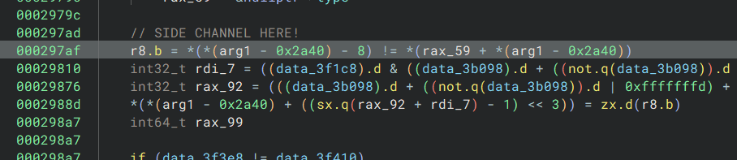

# obfuscated

Okay I realized I said the other writeup will be brief but this one is even more brief.

Through some analysis (prior completion of other Tigress rev challenges), I realized that this is using the Tigress obfuscator.

One thing about the Tigress obfuscator is that most == and != comparisons still stay as cmp, sete, and cmp, setne respectively. So, I searched in Binja decompilation for all the == and != and tried to see if any were sidechannelable (and guessed that the actual logic wasn't super complex so == or != would be used).

Lo and behold, one of the != literally compares one char of input to one char of some "correct" value. So I just wrote a quick gdbscript to brute force and sidechannel.

See solve script for side channel

After we get the password we just connect to remote and get the flag after watching an amazing video.